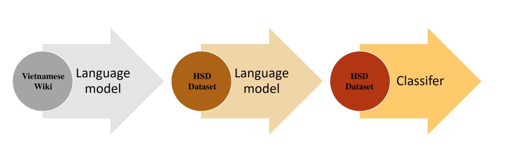
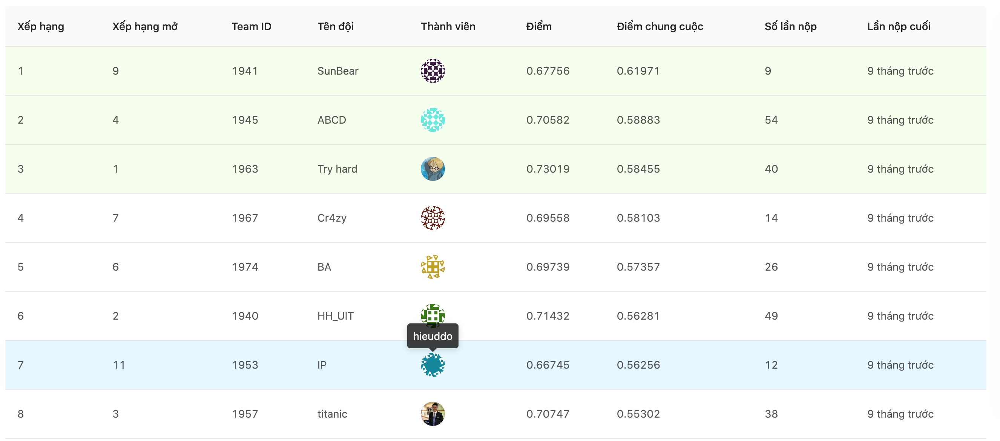

# Phát hiện Ngôn ngữ thù địch trên Mạng xã hội

## Giới thiệu
  * Ngôn ngữ thù địch (hate speech): là những phát ngôn tấn công, sỉ nhục một cá nhân hoặc một nhóm cá nhân cụ thể với mục đích gieo rắc sự căm ghét hay kêu gọi bạo lực đối với người hoặc nhóm người này.
  * Theo một nghiên cứu mới đây, Việt Nam lọt top 5 nước hành xử kém văn minh nhất trên mạng xã hội. Do vậy, việc phát hiện và cảnh báo các ngôn ngữ thù địch là cần thiết.
  * Dữ liệu sử dụng là dữ liệu từ cuộc thi [VLSP2019-HSD](https://vlsp.org.vn/vlsp2019/eval/hsd) được tổ chức bởi VLSP (Association for Vietnamese Language and Speech Processing).

## Chức năng
  Ứng dụng có chức năng phát hiện ngôn ngữ thù địch trên mạng xã hội [VOZ](https://voz.vn/). Từ đó cảnh báo, giúp chặn những người dùng phát ngôn ngôn ngữ thù địch.

## Kỹ thuật
### Crawler threads trên mạng xã hội
  * Mô đun crawl dữ liệu các bài viết được cài đặt sử dụng thư viện [Scrapy](https://scrapy.org/), một thư viện rất nhanh giúp tăng tốc độ crawl các bài viết, bình luận.
  * Nội dung crawl bao gồm từng bình luận ứng với người dùng, giúp phục vụ cho mục đích chặn người dùng sau này.

### Mô hình dự đoán hate speech
  Mô hình được sử dụng là bộ phân lớp dựa trên mô hình ngôn ngữ dạng Regularizing-LSTM. Mô hình ngôn ngữ được huấn luyện trên 1GB văn bản wikipedia, hiệu chỉnh trên bộ dữ liệu văn bản của VLSP. Bộ encoder của mô hình ngôn ngữ được sử dụng để biểu diễn vector cho các văn bản.

## Hiệu suất
  * Mô hình được đánh giá trên bộ dữ liệu VLSP2019-HSD với dữ liệu tổng là 20345 bài viết với phân bố lần lượt là 712, 1017 và 18616 cho các nhãn HATE, OFFENSIVE và CLEAN (OFFENSIVE là ngôn ngữ không trong sáng nhưng không nhắm vào đối tượng cụ thể).
  * Độ đo sử dụng đánh giá là Macro-F1 score. Kết quả cuối cùng đạt được là 0.67 trên tập public và 0.56 trên tập private.

